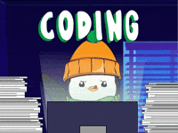

# Sistema de verificação de idade 🔞

## Atributos usados para resolver o problema
- Lógica
    - algoritmo
    - abstração
    - decomposição
- Sintaxe
- Conhecimentos
    - estruturas condicionais
    - dicionário
    - lista
    - uso de for

### O programa faz uma confirmação de idade para  a ida em um evento. Utilizei o try e o except para pegar erros de tipos na idade. **Foi projetado de forma mais robusta com uso de dict e list** , embora não precise no enunciado.

- [ ] Tarefa pendente
- [x] Tarefa concluída 😊

